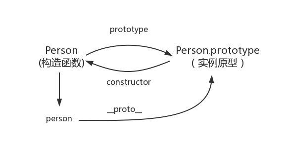

<!--
 * @Description: In User Settings Edit
 * @Author: your name
 * @Date: 2019-09-04 11:12:22
 * @LastEditTime: 2019-09-08 17:09:59
 * @LastEditors: Please set LastEditors
 -->
## 原型到原型链
+ 创建对象并实例化
```js
    //创建一个对象
    function Person(){}
    //对象实例化
    let person = new Person()
    //在实例上添加一个属性
    person.name = 'aaa'
    //在对象的原型上添加一个属性
    Person.prototype.name= 'bbb'
    var person1 = new Person()
    var person2 = new Person()
    console.log(person.name) //aaa
    console.log(person1.name)   //bbb
    console.log(person2.name)   //bbb

    //如果不给Person.prototype上添加属性，则返回undefined,因为首先在实例上找这个属性，如果没有，则会在对象的原型上找，如果没有，则返回undefined
    console.log(person1.name) //undefined
    console.log(person2.name) //undefined
```
+ prototype
  - 对象的prototype属性指向一个对象，即实例的原型
  - 看下构造函数和实例原型之间的关系
  

+ __proto__
  - 这个就是实例的原型
  ```js
    person.__proto__ === Person.prototype
    console.log(person.__proto__ === Person.prototype) //true
  ```
  - 更新下关系图
  
  - 既然实例对象和构造函数都可以指向原型，那么原型是否有属性指向构造函数或者实例呢?

+ constructor
  - 指向实例倒是没有，因为一个构造函数可以生成多个实例，但是原型指向构造函数倒是有的，这就要讲到第三个属性：constructor，每个原型都有一个 constructor 属性指向关联的构造函数。
  ```js
    console.log(Person.prototype.constructor === Person) //true
  ```
  - 更新下关系图
  

+ 综上得出
```js
    function Person(){}
    let person = new Person()

    console.log(person.__proto__ === Person.prototype) //true
    console.log(Person === Person.prototype.constructor) //true

    //获得对象的原型
    console.log(Object.getPrototypeOf(person) === Person.prototype) //true
```

## 实例和原型的关系
+ 当读取实例的属性时，如果找不到，就会查找与对象关联的原型中的属性，如果还查不到，就去找原型的原型，一直找到最顶层为止。
```js
    function Person2(){}
    Person2.prototype.name = 'aa'

    var person2 = new Person2()
    person2.name = 'bbb'

    console.log(person2.name) //先在实例上找，实例上有name，则返回bbb
    delete person2.name //删除实例上的name属性
    console.log(person2.name) //先在实例上找，实例上没有，则在原型上找，原型上有，则返回aa，原型上没有则一直往原型的原型上找，还是没有，则返回undefined
```

## 原型的原型
```js
    var obj = new Object()
    obj.name = 'curry'
    console.log(obj.name) //curry04
```
+ 其实原型对象就是通过 Object 构造函数生成的，结合之前所讲，实例的 __proto__ 指向构造函数的 prototype ，所以我们再更新下关系图：
+ 更新关系图


## 原型链
+ Object.prototype 的原型是什么
```js
    console.log(Object.prototype.__proto__ === null) // true
```
+ 更新关系图
